<h2>TensorFlow-FlexUNet-Image-Segmentation-Congenital-Heart-Disease (2026/03/01)</h2>
Sarah T.  Arai 
Software Laboratory antillia.com  
This is the first experiment of Image Segmentation for <b>Congenital Heart Disease (CHD) miccai19</b> based on our <a href="./src/TensorFlowFlexUNet.py">TensorFlowFlexUNet</a> 
(TensorFlow Flexible UNet Image Segmentation Model for Multiclass), 
and a 512x512 pixels PNG 
<a href="https://drive.google.com/file/d/1fgszPqmtdup4dCsWEito0PbIowFViQsv/view?usp=sharing">
<b>Congenital-Heart-Disease-miccai19-subset-ImageMask-Dataset.zip</b></a> which was derived by us from   
<a href="https://www.kaggle.com/datasets/xiaoweixumedicalai/chd68-segmentation-dataset-miccai19/data">
<b>CHD68_segmentation_dataset_miccai19</b> </a> on the kaggle.com.
  

<b>Actual Image Segmentation for Congenital-Heart-Disease Images of  512x512 pixels </b> 
As shown below, the inferred masks predicted by our segmentation model trained by the dataset appear similar to the ground truth masks.
 
<a href="#color-class-mapping-table">Color class mapping table</a>
  
<table>
<tr>
<th>Input: image</th>
<th>Mask (ground_truth)</th>
<th>Prediction: inferred_mask</th>
</tr>
<tr>
<td>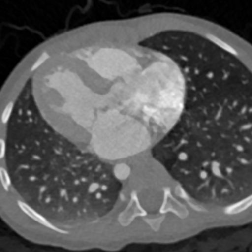</td>
<td>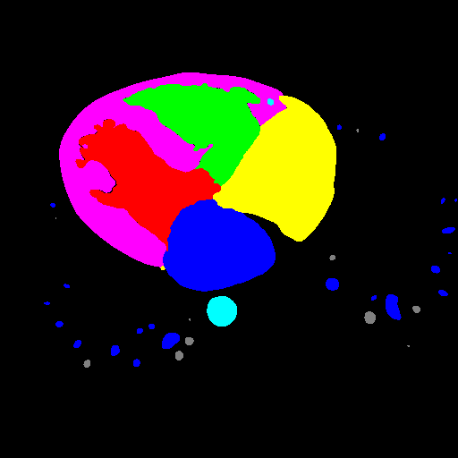</td>
<td></td>
</tr>

<tr>
<td>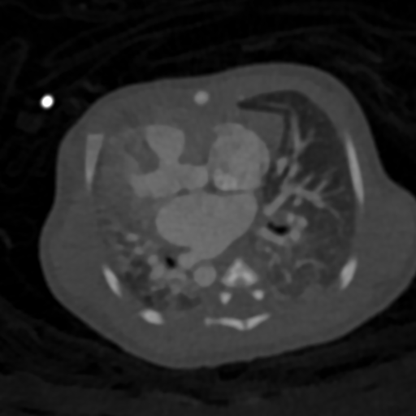</td>
<td>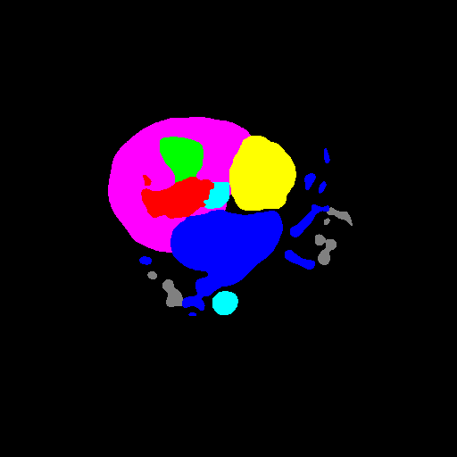</td>
<td></td>
</tr>

<tr>
<td>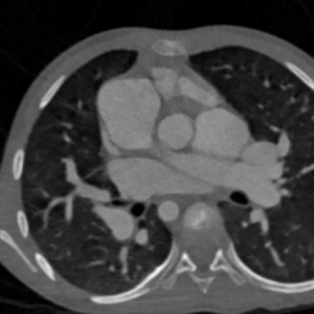</td>
<td>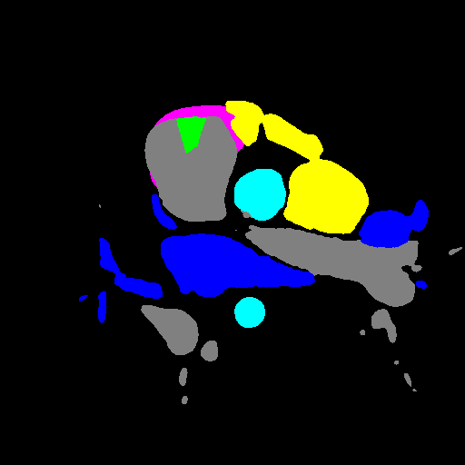</td>
<td></td>
</tr>
</table>

 
<h3>1  Dataset Citation</h3>
The dataset used here was derived from   
<a href="https://www.kaggle.com/datasets/xiaoweixumedicalai/chd68-segmentation-dataset-miccai19/data">
<b>CHD68_segmentation_dataset_miccai19</b> </a> 
<b>Whole-heart-and-great-vessel-segmentation-of-chd_segmentation</b>
 on the kaggle.com.
  
The following explanation was taken from the kaggle.com web site.
  
<b>About Dataset</b> 
<b>Dataset_Type-B-Aortic-Dissection</b> 
A dataset of whole heart and great vessel segmentation of chd_segmentation is published. 

Our dataset includes 68 CT images with labels. The label includes: 
 left ventricle (label: 1),  
 right ventricle (label: 2),  
 left atrium (label: 3),  
right atrium (label: 4),  
myocardium (label: 5),  
aorta (label: 6), and   
pulmonary artery (label: 7). 
 
You notice other labels such 14 etc., you can just ignore them as they are labels corresponding to airways etc. 
 
Our dataset is available at https://notredame.box.com/v/chdsegmentationdataset, and please send emails to Prof. Yiyu Shi yshi4@nd.edu for the password.
  
If you used our dataset, please consider to cite our paper in MICCAI 2019, Xiaowei Xu, Tianchen Wang, Yiyu Shi, Haiyun Yuan, Qianjun Jia, Meiping Huang, and Jian Zhuang,  
"Whole-Heart and Great Vessel Segmentation in Congenital Heart Disease using Deep Neural Networks and Graph Matching," 
 in Proc. of Medical Image Computing and Computer Assisted Interventions (MICCAI), Shenzhen, China, 2019.
   
The diagnosis of the dataset is at <a href="https://github.com/XiaoweiXu/Whole-heart-and-great-vessel-segmentation-of-chd_segmentation">
https://github.com/XiaoweiXu/Whole-heart-and-great-vessel-segmentation-of-chd_segmentation</a>.
  
<b>HIGHLIGHT 20231101: We have deployed the dataset on Kaggle!</b> 
Please refer to our related paper <a href="https://link.springer.com/chapter/10.1007/978-3-030-32245-8_53">
https://link.springer.com/chapter/10.1007/978-3-030-32245-8_53</a>.
  
<b>License</b> 
<a href="https://www.apache.org/licenses/LICENSE-2.0">Apache 2.0</a>
 
 
<h3>
2 Congenital-Heart-Disease ImageMask Dataset
</h3>
 If you would like to train this Congenital-Heart-Disease Segmentation model by yourself,
please down load our dataset <a href="https://drive.google.com/file/d/1fgszPqmtdup4dCsWEito0PbIowFViQsv/view?usp=sharing">
<b>Congenital-Heart-Disease-miccai19-subset-ImageMask-Dataset.zip</b>
</a> on the google drive, expand the downloaded, and put it under <b>./dataset/</b> to be.
<pre>
./dataset
└─Congenital-Heart-Disease
    ├─test
    │   ├─images
    │   └─masks
    ├─train
    │   ├─images
    │   └─masks
    └─valid
        ├─images
        └─masks
</pre>
 
We used the following 8 classes and colors mapping table to generate the <b>Congenital-Heart-Disease-miccai19-subset</b>
 with colorized masks from the <b>CHD68_segmentation_dataset_miccai19</b> dataset.  
<a id="color-class-mapping-table"><b>Lumbar-Spine color class mapping table</b></a>
  
<table border=1 style='border-collapse:collapse;' cellpadding='5'>
<tr><th>Indexed Color</th><th>Color</th><th>RGB</th><th>Class</th></tr>
<tr><td>0</td><td with='80' height='auto'></td><td>(0, 0, 0)</td><td>Background</td></tr>
<tr><td>1</td><td with='80' height='auto'></td><td>(255, 0, 0)</td><td>Left Ventricle</td></tr>
<tr><td>2</td><td with='80' height='auto'></td><td>(0, 255, 0)</td><td>Right Ventricle</td></tr>
<tr><td>3</td><td with='80' height='auto'></td><td>(0, 0, 255)</td><td>Left Atrium</td></tr>
<tr><td>4</td><td with='80' height='auto'></td><td>(255, 255, 0)</td><td>Right Atrium</td></tr>
<tr><td>5</td><td with='80' height='auto'></td><td>(255, 0, 255)</td><td>Myocardium</td></tr>
<tr><td>6</td><td with='80' height='auto'></td><td>(0, 255, 255)</td><td>Aorta</td></tr>
<tr><td>7</td><td with='80' height='auto'></td><td>(128, 128, 128)</td><td>Pulmonary Artery</td></tr>
</table>
  
<b>Congenital-Heart-Disease Statistics</b> 
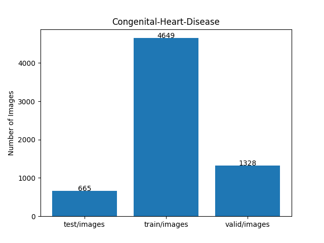 
 
As shown above, the number of images of train and valid datasets is large enough to use for a training set of our segmentation model.
  

<b>Train_images_sample</b> 
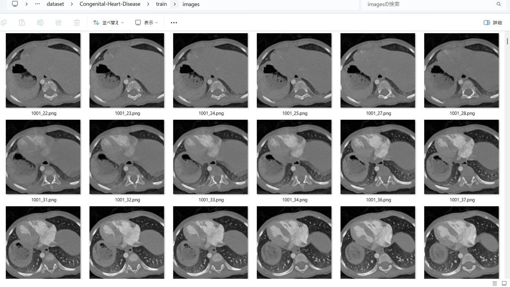
 
<b>Train_masks_sample</b> 
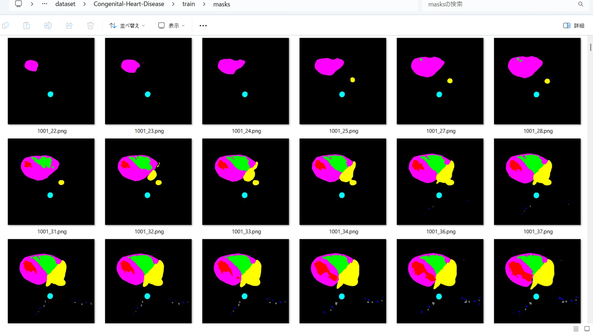
 
<h3>
3 Train TensorflowFlexUNet Model
</h3>
 We trained Congenital-Heart-Disease TensorflowFlexUNet Model by using the following
<a href="./projects/TensorFlowFlexUNet/Congenital-Heart-Disease/train_eval_infer.config"> <b>train_eval_infer.config</b></a> file.  
Please move to ./projects/TensorFlowFlexUNet/Congenital-Heart-Disease, and run the following bat file. 
<pre>
>1.train.bat
</pre>
, which simply runs the following command. 
<pre>
>python ../../../src/TensorFlowFlexUNetTrainer.py ./train_eval_infer.config
</pre>

<b>Model parameters</b> 
Defined a small <b>base_filters=16</b> and a large <b>base_kernels=(11,11)</b> for the first Conv Layer of Encoder Block of 
<a href="./src/TensorFlowFlexUNet.py">TensorFlowFlexUNet.py</a> 
and a large num_layers (including a bridge between Encoder and Decoder Blocks).
<pre>
[model]
image_width    = 512
image_height   = 512
image_channels = 3
input_normalize = True
normalization  = False
num_classes    = 8
base_filters   = 16
base_kernels  = (11,11)
num_layers    = 8
dropout_rate   = 0.05
dilation       = (1,1)
</pre>
<b>Learning rate</b> 
Defined a small learning rate.  
<pre>
[model]
learning_rate  = 0.00007
</pre>
<b>Loss and metrics functions</b> 
Specified "categorical_crossentropy" and "dice_coef_multiclass". 
<pre>
[model]
loss           = "categorical_crossentropy"
metrics        = ["dice_coef_multiclass"]
</pre>
<b >Learning rate reducer callback</b> 
Enabled learing_rate_reducer callback, and a small reducer_patience.
<pre> 
[train]
learning_rate_reducer = True
reducer_factor     = 0.5
reducer_patience   = 4
</pre>
<b>Early stopping callback</b> 
Enabled early stopping callback with patience parameter.
<pre>
[train]
patience      = 10
</pre>
<b></b> 
<b>RGB color map</b> 
rgb color map dict for Congenital-Heart-Disease 1+7 classes. 
<pre>
[mask]
mask_file_format = ".png"
;Congenital-Heart-Disease 1+7
rgb_map = {(0,0,0):0,  (255,0,0):1, (0,255,0):2, (0,0,255):3, (255,255,0):4, (255,0,255):5, (0,255,255):6, (128,128,128):7,}
</pre>
<b>Epoch change inference callbacks</b> 
Enabled epoch_change_infer callback. 
<pre>
[train]
epoch_change_infer       = True
epoch_change_infer_dir   =  "./epoch_change_infer"
epoch_changeinfer        = False
epoch_changeinfer_dir    = "./epoch_changeinfer"
num_infer_images         = 6
</pre>
By using this epoch_change_infer callback, on every epoch_change, the inference procedure can be called
 for 6 images in <b>mini_test</b> folder. This will help you confirm how the predicted mask changes 
 at each epoch during your training process.    
<b>Epoch_change_inference output at starting (1,2,3)</b> 
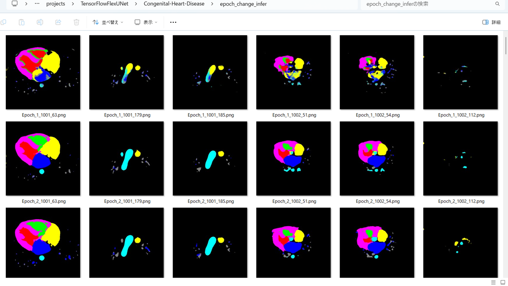 
 
<b>Epoch_change_inference output at middle-point (23,24,25)</b> 
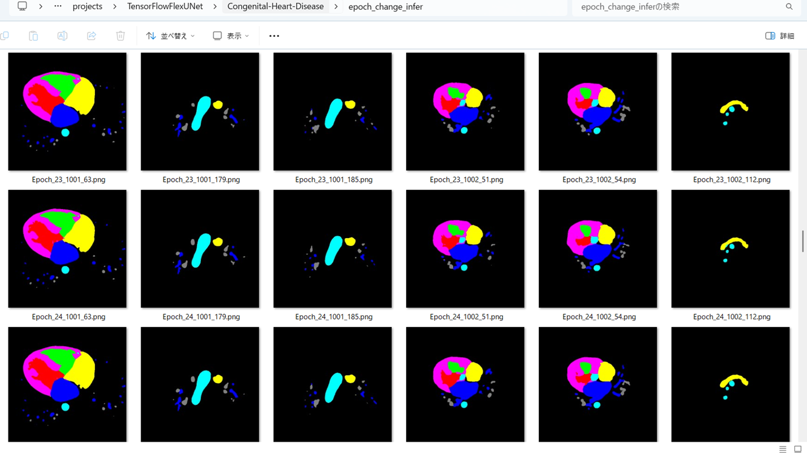 
 
<b>Epoch_change_inference output at ending (48,49,50)</b> 
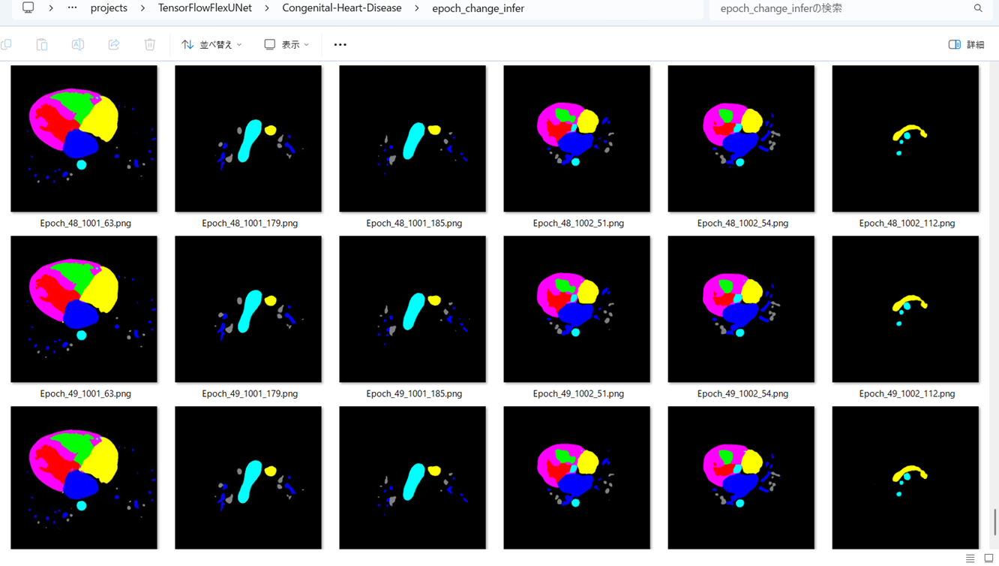 

 
In this experiment, the training process was terminated at epoch 50.  
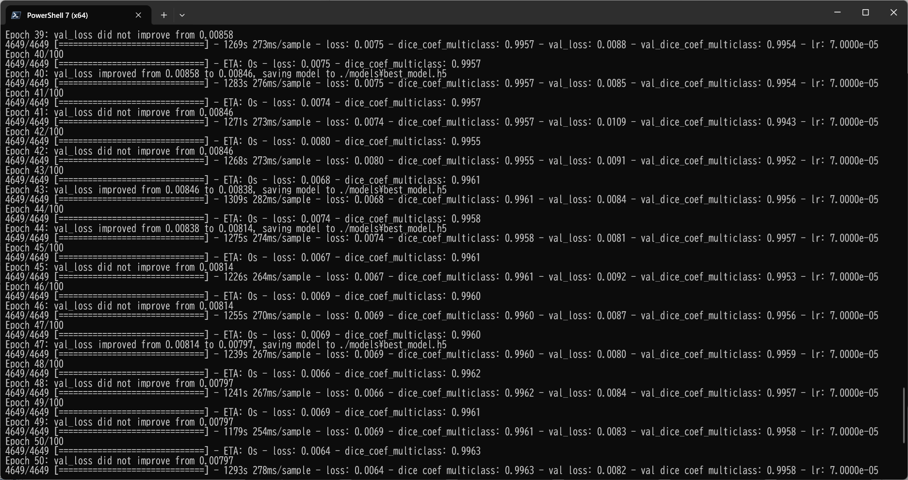 
 
<a href="./projects/TensorFlowFlexUNet/Congenital-Heart-Disease/eval/train_metrics.csv">train_metrics.csv</a> 
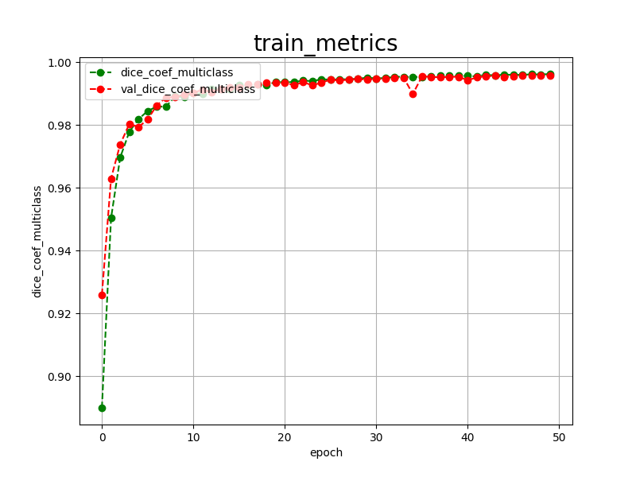 

 
<a href="./projects/TensorFlowFlexUNet/Congenital-Heart-Disease/eval/train_losses.csv">train_losses.csv</a> 
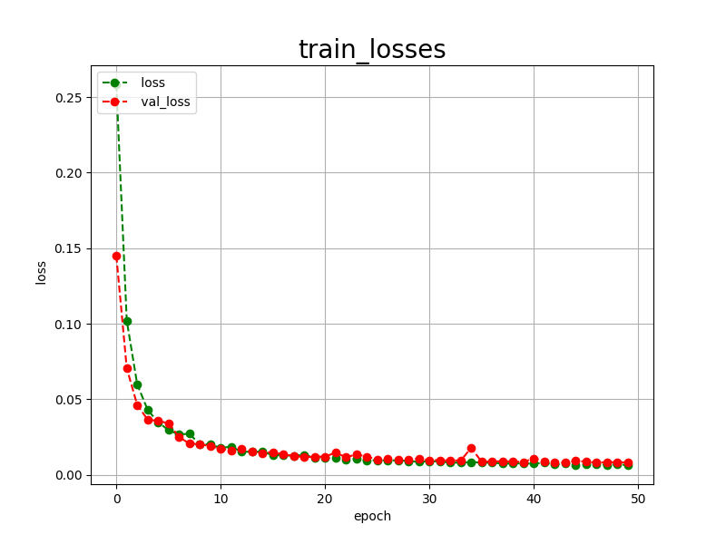 
 
<h3>
4 Evaluation
</h3>
Please move to a <b>./projects/TensorFlowFlexUNet/Congenital-Heart-Disease</b> folder, and run the following bat file to evaluate TensorflowFlexUNet model for Congenital-Heart-Disease. 
<pre>
>./2.evaluate.bat
</pre>
This bat file simply runs the following command.
<pre>
>python ../../../src/TensorFlowFlexUNetEvaluator.py  ./train_eval_infer.config
</pre>
Evaluation console output: 
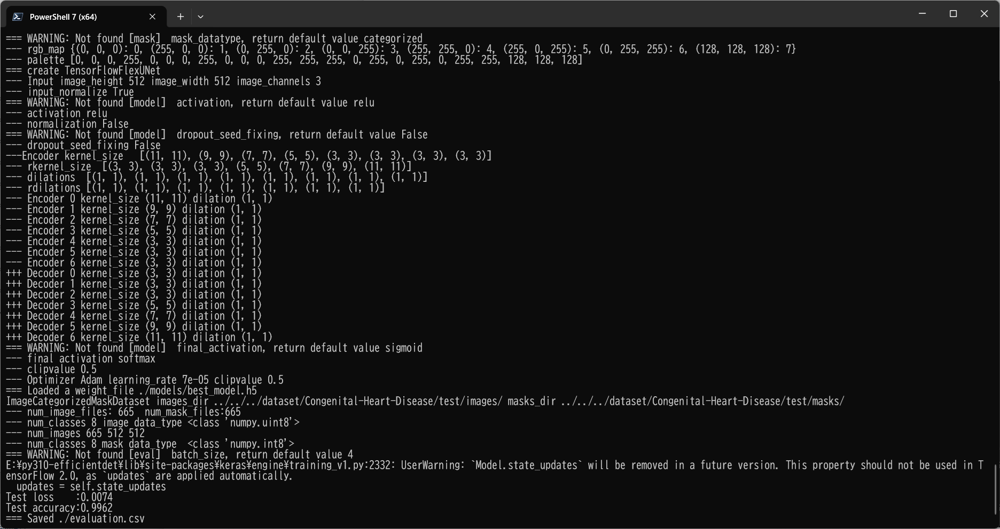
  Image-Segmentation-Congenital-Heart-Disease

<a href="./projects/TensorFlowFlexUNet/Congenital-Heart-Disease/evaluation.csv">evaluation.csv</a> 
The loss (categorical_crossentropy) to this Congenital-Heart-Disease/test was very low, and dice_coef_multiclass  very high as shown below.
 
<pre>
categorical_crossentropy,0.0074
dice_coef_multiclass,0.9962
</pre>
 
<h3>5 Inference</h3>
Please move to a <b>./projects/TensorFlowFlexUNet/Congenital-Heart-Disease</b> folder, and run the following bat file to infer segmentation regions for images by the Trained-TensorflowFlexUNet model for Congenital-Heart-Disease. 
<pre>
>./3.infer.bat
</pre>
This simply runs the following command.
<pre>
>python ../../../src/TensorFlowFlexUNetInferencer.py ./train_eval_infer.config
</pre>

<b>mini_test_images</b> 
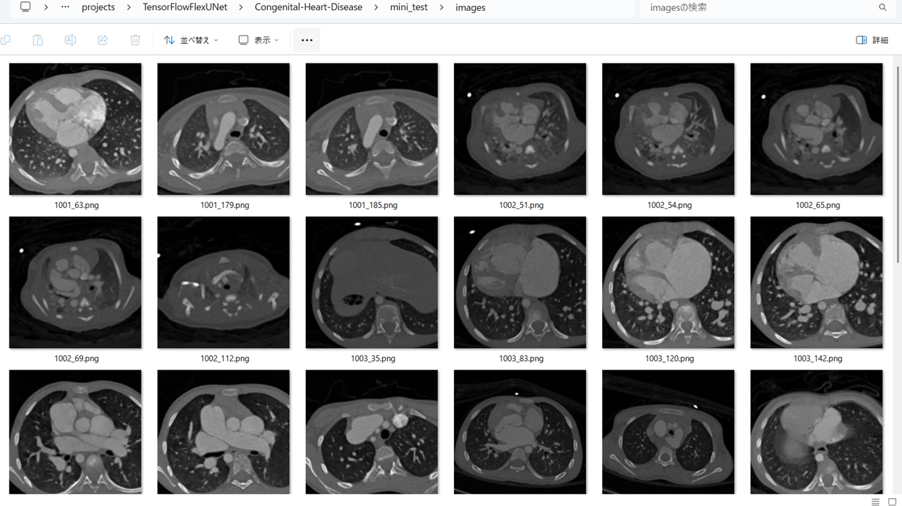 
<b>mini_test_mask(ground_truth)</b> 
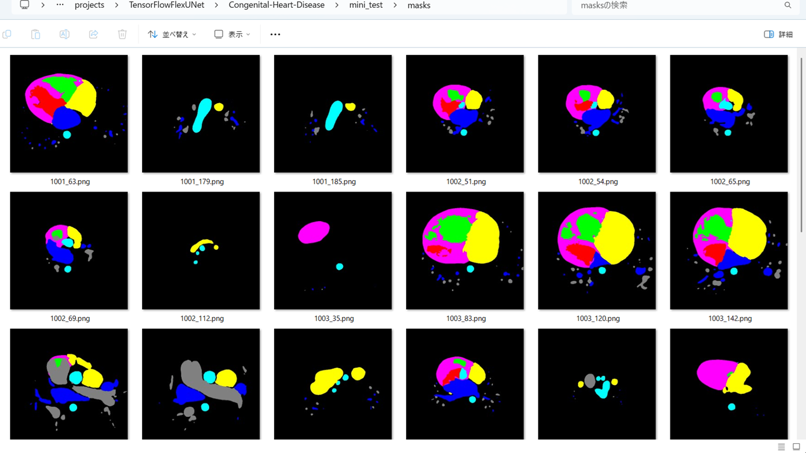 

<b>Inferred test masks</b> 
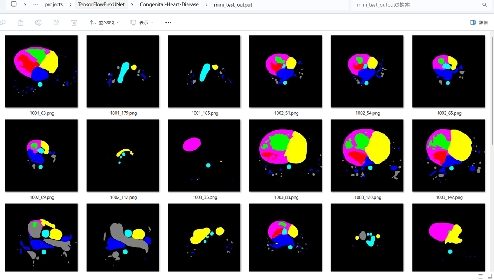 
 

<b>Enlarged images and masks for  Congenital-Heart-Disease  Images of 512x512 pixels</b> 
As shown below, the inferred masks predicted by our segmentation model trained by the dataset appear similar to the ground truth masks.
 
<a href="#color-class-mapping-table">Color class mapping table</a>
 
 
<table>
<tr>
<th>Input: image</th>
<th>Mask (ground_truth)</th>
<th>Prediction: inferred_mask</th>
</tr>
<tr>
<td>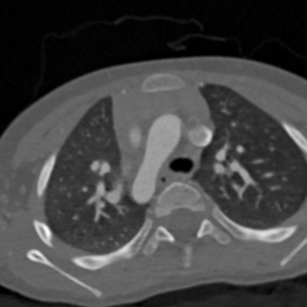</td>
<td>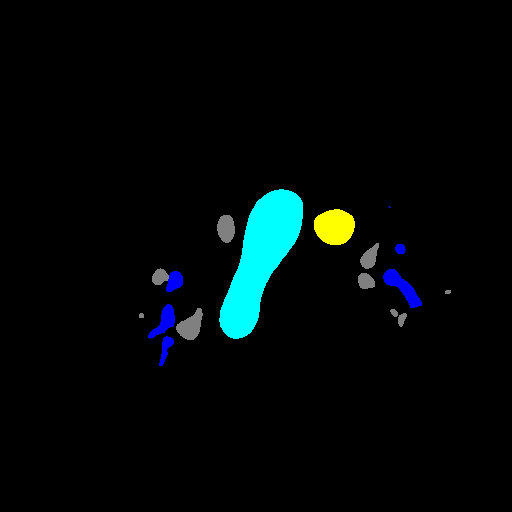</td>
<td>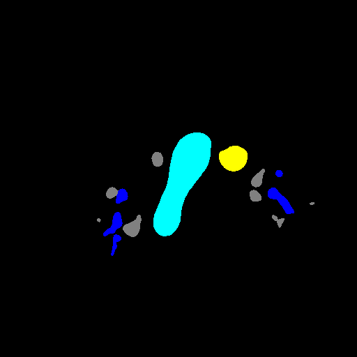</td>
</tr>

<tr>
<td>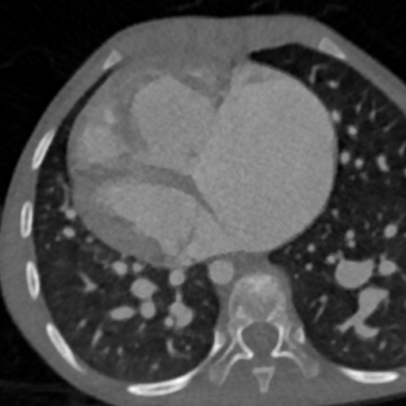</td>
<td>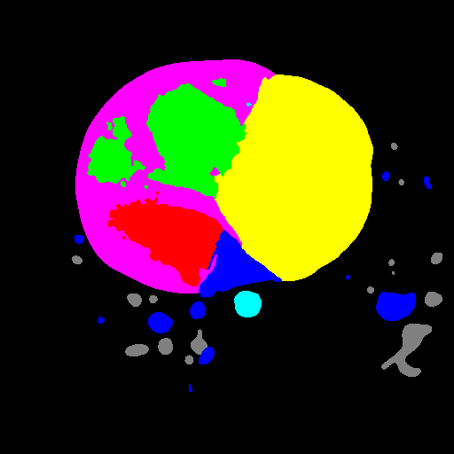</td>
<td></td>
</tr>

<tr>
<td>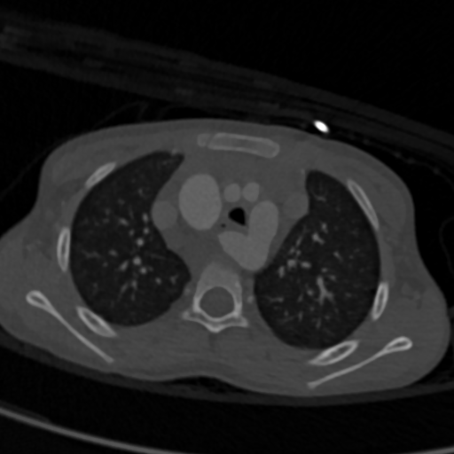</td>
<td></td>
<td></td>
</tr>
<tr>
<td>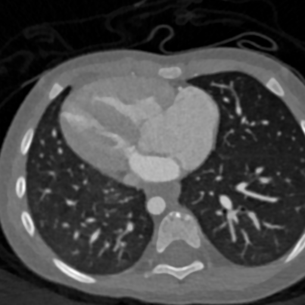</td>
<td>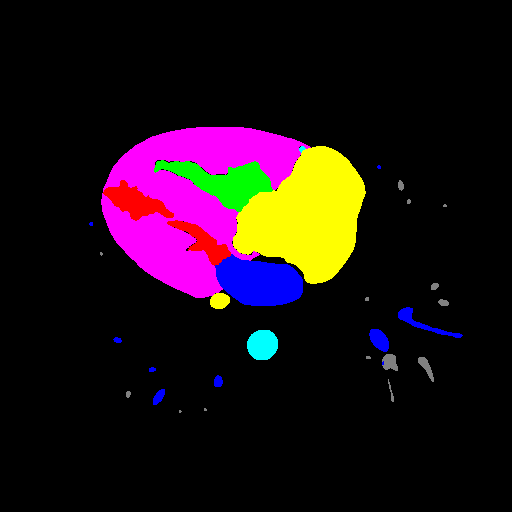</td>
<td>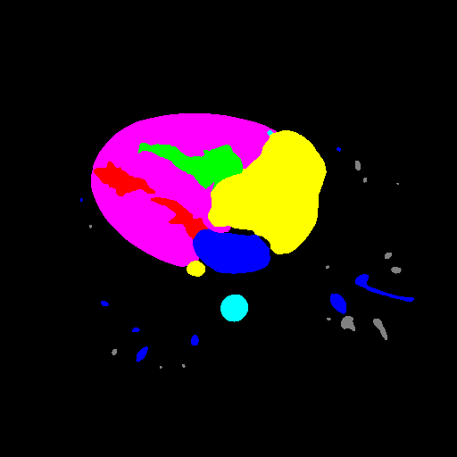</td>
</tr>
<tr>
<td>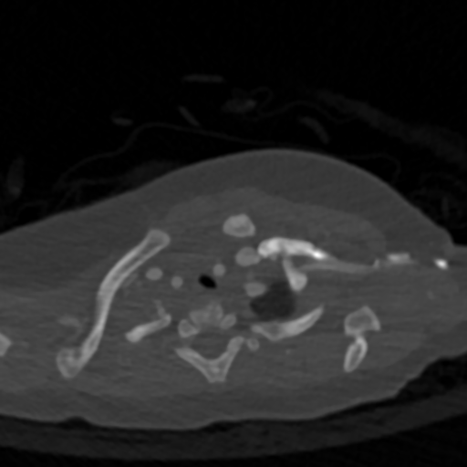</td>
<td></td>
<td></td>
</tr>
<tr>
<td>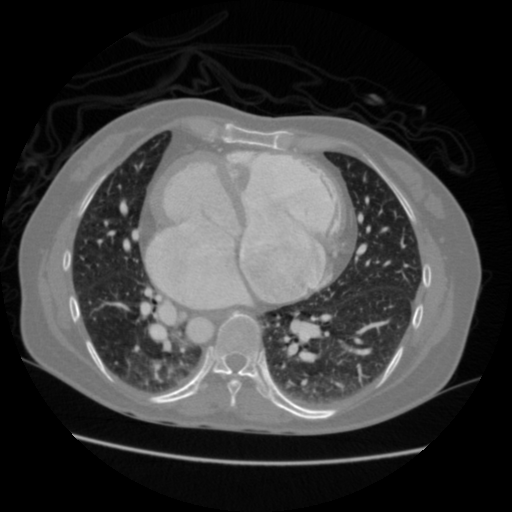</td>
<td>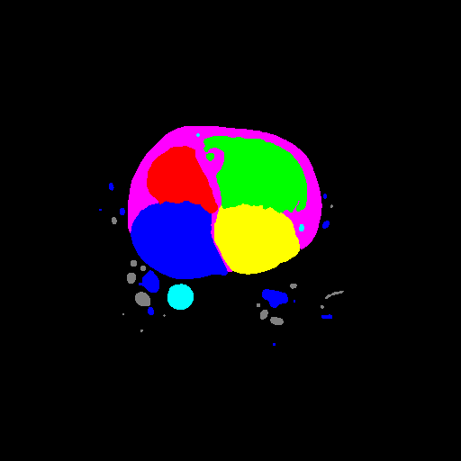</td>
<td></td>
</tr>
</table>

 
<h3>
References
</h3>
<b>1. A novel hybrid layer-based encoder–decoder framework for 3D segmentation in congenital heart disease</b> 
Yaoxi Zhu, Hongbo Li, Bingxin Cao, Kun Huang & Jinping Liu 
<a href="https://www.nature.com/articles/s41598-025-96251-9">
https://www.nature.com/articles/s41598-025-96251-9
</a>
  
<b>2. Segmental Approach to Imaging of Congenital Heart Disease1</b> 
: Chantale Lapierre, MD, Julie Déry, MD, Ronald Guérin, MD, Loïc Viremouneix, MD, Josée Dubois, MD, MSc, and Laurent Garel, MD 
<a href="https://pubs.rsna.org/doi/abs/10.1148/rg.302095112?journalCode=radiographics">
https://pubs.rsna.org/doi/abs/10.1148/rg.302095112?journalCode=radiographics</a>
  

<b>3. TensorFlow-FlexUNet-Image-Segmentation-Whole-Heart-HVSMR-2.0</b> 
Toshiyuki Arai  
<a href="https://github.com/sarah-antillia/TensorFlow-FlexUNet-Image-Segmentation-Whole-Heart-HVSMR-2.0">
https://github.com/sarah-antillia/TensorFlow-FlexUNet-Image-Segmentation-Whole-Heart-HVSMR-2.0
</a>
 
 
<b>4. TensorFlow-FlexUNet-Image-Segmentation-Model</b> 
Toshiyuki Arai  
<a href="https://github.com/sarah-antillia/TensorFlow-FlexUNet-Image-Segmentation-Model">
https://github.com/sarah-antillia/TensorFlow-FlexUNet-Image-Segmentation-Model
</a>
 
 
